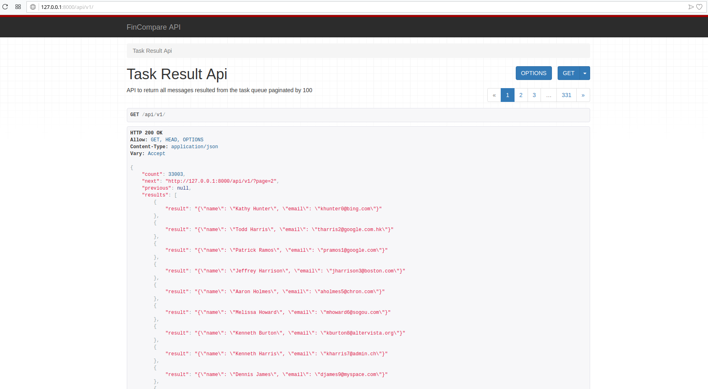
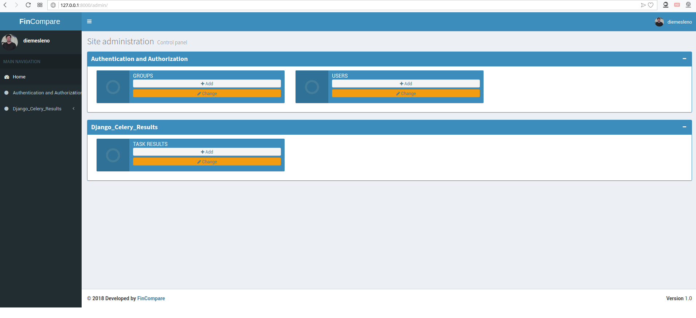

# SysCSV 
> Django APP to proccess a csv file in background with celery task, and share the content by API with another
project that consumes it and insert in a database using also a celery background task. 

### Task Description

Develop two separate programs that will:

### 1st Program:

Process CSV files and send each row to a message queue*. An example CSV file is attached.

### 2nd Program:

Consume the messages that are sent by the 1st program and insert them into a database table**. There can only be one record with the same email address. Imagine this program will be running on multiple servers or even on the same server with multiple processes at the same time.

*Can be any production ready distributed system such as redis, rabbitmq, sqs, or even kafka.

**Can be any modern relational database but the solution should be independent from the database server.

### Tips And Tricks:

- Pay attention to the details in the description.
- Develop the programs as you are developing it for a production system in a real life scenario.
- Any programming language can be used but the languages that are more suitable to this specific scenario is a plus.

## Technologies utilized
* Python 3.6.5
* Django 2.0.6
* PostgreSQL 9.5+

### Test Environment

### Installation

Any Operating System with docker/docker-compose installed:

```
a) git clone https://github.com/diemesleno/syscsv.git

b) cd syscsv

c) docker-compose build

d) docker-compose up -d

e) docker-compose run -d -p 8000:8000 --name sys1 sys1 python manage.py runserver 0.0.0.0:8000

f) docker exec -it sys1 python manage.py migrate

g) docker exec -it sys1 python manage.py createsuperuser

h) docker exec -it sys1 python manage.py test

i) docker exec -it sys1 celery -A sys1 worker -l info

j) Access http://127.0.0.1:8000 and click in the button to proccess the csv file

k) Access http://127.0.0.1:8000/api/v1/ to check the api with the data proccessed

l) Access http://127.0.0.1:8000/admin and log in using the superuser created in the step (g) to
check the information with the result

m) docker-compose run -d -p 8080:8080 --name sys2 sys2 python manage.py runserver 0.0.0.0:8080

n) docker exec -it sys2 python manage.py migrate

o) docker exec -it sys2 python manage.py createsuperuser

p) docker exec -it sys2 python manage.py test

q) docker exec -it sys2 celery -A sys2 worker -l info

r) Access http://127.0.0.1:8080 and click the button to consume the API and populate the database

s) Access http://127.0.0.1:8080/admin and log in using the superuser created in the step (o) to
check the information with the data processed
```

## Some screenshots

### Sys1 [CSV Processing] Main Page


### Sys1 [CSV Processing] API Page


### Sys1 [CSV Processing] Admin Page


### Sys2 [DB Processing] Main Page


### Sys2 [DB Processing] Adimin Page


## Release History
* 1.0.0
    * First release
* 0.3.0
    * Fixing issues
* 0.2.9
    * Testing deployment
* 0.2.8
    * Creation of Dockerfiles
* 0.2.7
    * Preparing files to production
* 0.2.6
    * Fixing issues Sys2
* 0.2.5
    * Testing Sys2
* 0.2.4
    * Development of Sys2 URLs
* 0.2.3
    * Development of  core Tasks
* 0.2.2
    * Development of  core celery configuration
* 0.2.1 
    * Development of core URLs
* 0.2.0
    * Development of core Views
* 0.1.9
    * Development of core Models
* 0.1.8
    * Sys2 Settings configuration
* 0.1.7
    * Application core creation
* 0.1.6
    * Project Sys2 creation
* 0.1.5
    * Fixing issues Sys1
* 0.1.4
    * Testing Sys1
* 0.1.3
    * Development of Sys1 URLs
* 0.1.2
    * Development of  core Tasks
* 0.1.1
    * Development of  core celery configuration
* 0.1.0
    * Development of  core Templates
* 0.0.9
    * Development of  core URLs
* 0.0.8
    * Development of  Core Views
* 0.0.7
    * Development of  API URLs
* 0.0.6
    * Development of  API Views
* 0.0.5
    * Development of  API Serializer
* 0.0.4
    * Sys1 Settings configuration
* 0.0.3
    * Application API creation
* 0.0.2
    * Application core creation
* 0.0.1
    * Project Sys1 creation

## Meta

Diemesleno Souza Carvalho – [@diemesleno](https://twitter.com/diemesleno) – diemesleno@gmail.com


[https://github.com/diemesleno/syscsv](https://github.com/diemesleno/)